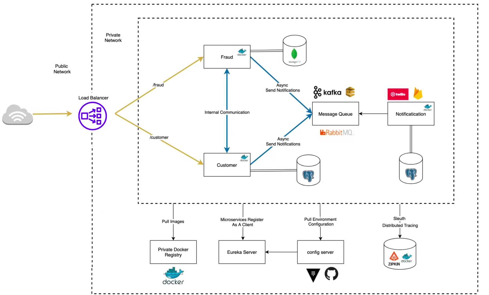

# Microservices Application

A distributed microservices application built with Spring Boot, featuring service discovery, API gateway, distributed tracing, and asynchronous messaging.

---

## Architecture Overview

The application is composed of several independently deployable services that communicate through well-defined interfaces:

- **Customer Service** – Core service exposing REST endpoints consumed by the Fraud service.
- **Fraud Service** – Communicates synchronously with the Customer service via exposed HTTP endpoints.

> **Note:** Inter-service communication is synchronous (not event-driven).



---

## Components

### Service Discovery — Eureka
Eureka acts as the service registry and enables client-side load balancing across multiple instances of each microservice. It is also responsible for facilitating service-to-service communication between Fraud and Customer.

### API Gateway
An external-facing API Gateway serves as the entry point to the application. It protects the private internal network and routes all incoming requests to the Customer service.

### Distributed Tracing — Zipkin
Zipkin is integrated to trace requests as they flow across multiple services, making it easier to debug latency issues and failures in the distributed system.

### Asynchronous Messaging — RabbitMQ + Spring AMQP
To prevent latency in responses from the Notification microservice, a RabbitMQ message broker is used with Spring AMQP. This decouples the Notification service from the request lifecycle.

### Load Balancing
Traffic across service instances is managed by a LoadBalancer, ensuring even distribution and high availability.

---

## Containerization

The application is containerized using **[Google Jib](https://github.com/GoogleContainerTools/jib)**, which builds optimized Docker images without requiring a local Docker daemon.

- **Docker images** are published to [jakubkap's DockerHub account](https://hub.docker.com/u/jakubkap).
- **The containerized version of the application** is maintained on the `main` branch.
- **Kubernetes manifests and configuration** are maintained on the [`main_with_k8s`](../../tree/main_with_k8s) branch.

---

## Getting Started

> **Prerequisites:** Docker and Java 17+ must be installed before running the application.

The containerized application (Docker + testing) lives on `main`. If you're looking for the Kubernetes variant, switch to [`main_with_k8s`](../../tree/main_with_k8s) instead.

```bash
git clone <repo-url>
# containerized app with Docker is on main (default)
# for Kubernetes: git checkout main_with_k8s
```

---

## Running the Application

### Step 1 — Pre-requisite: Create databases

Before starting the notification, fraud, and customer services, make sure three PostgreSQL databases exist with the following names:

- `notification`
- `fraud`
- `customer`

They should be located in a new server.
Server details:
- General -> Name: `amigoscode`,
- Connection -> Hostname/address: `postgres`,
- Connection -> Username: `amigoscode`,
- Connection -> Password: `password`,
- Connection -> Save password: ✅.

### Step 2 — Build Docker images

Build all service images at once using the `build-docker-image` Maven profile:

```bash
mvn clean package -P build-docker-image
```

### Step 3 — Push images to DockerHub

Push each image to your DockerHub account (replace `your_username_on_DockerHub` with your actual username):

```bash
docker push your_username_on_DockerHub/apigw:1.0-SNAPSHOT
docker push your_username_on_DockerHub/eureka-server:1.0-SNAPSHOT
docker push your_username_on_DockerHub/customer:1.0-SNAPSHOT
docker push your_username_on_DockerHub/fraud:1.0-SNAPSHOT
docker push your_username_on_DockerHub/notification:1.0-SNAPSHOT
```

### Step 4 — Start containers in order

Services must be started in the following order to satisfy dependencies:

1. `postgres`
2. `pgadmin`
3. `zipkin`
4. `rabbitmq`
5. `eureka-server`
6. `notification`
7. `fraud`
8. `customer`
9. `apigw`

```bash
docker compose up -d postgres
docker compose up -d pgadmin
//create databases mentioned in Pre-requisite
docker compose up -d zipkin
docker compose up -d rabbitmq
docker compose up -d eureka-server
docker compose up -d notification
docker compose up -d fraud
docker compose up -d customer
docker compose up -d apigw

```

---

## API Usage

Thanks to the API Gateway, all external traffic is routed through a single entry point. The Customer service is available at:

```
http://localhost:8083/api/v1/customers
```

**Create a customer — example POST request:**

```json
POST http://localhost:8083/api/v1/customers

{
  "firstName": "John",
  "lastName": "Doe",
  "email": "john@gmail.com"
}
```

---

## Testing & Monitoring

### Service UIs

| Service | URL |
|---|---|
| Zipkin (Distributed Tracing) | http://localhost:9411 |
| pgAdmin (Database UI) | http://localhost:5050 |
| RabbitMQ Management | http://localhost:15672 |
| Eureka Server Dashboard | http://localhost:8761 |

### Testing Asynchronous Messaging (RabbitMQ)

1. Send a POST request to create a customer.
2. Check the logs to confirm the Fraud service processes the event.
3. Verify the message was produced and consumed correctly through RabbitMQ.

### Testing Distributed Tracing (Zipkin)

1. Open the Zipkin UI at http://localhost:9411.
2. Make API calls to the Customer service.
3. Verify that traces show the full service-to-service communication chain.
